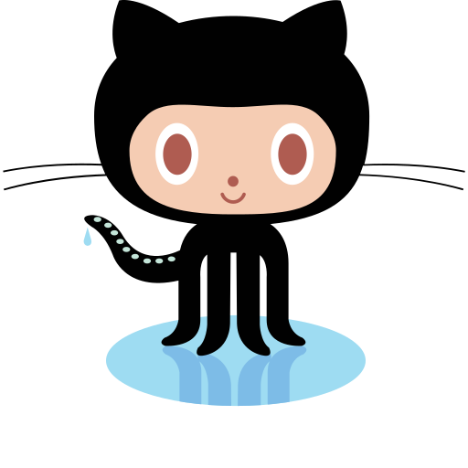

    

&nbsp;

> <h3 >Hey!  Nice to see you.</h3>
>
> - 👨🏻‍💻 I'm Hung - Software Engineer with ❤️ and 🔥
> - 💁🏻‍♂️ I'm not lazy, I'm just buffering
> - 🙆🏻‍♂️ JavaScript and Movies fanboy
> - 👏 Everybody makes some noises!
>
> &nbsp;
>
> <h4 >🙋🏻‍♂️ &nbsp;Profiles</h4>
>
> 
 
> &nbsp;&nbsp;
> &nbsp;&nbsp;
> &nbsp;&nbsp;
> &nbsp;&nbsp;
> &nbsp;&nbsp;
> &nbsp;&nbsp;
> 

> &nbsp;
>
> <h4 >🛠 &nbsp;Interested technologies and topics</h4>
>
> 
 
> &nbsp;&nbsp;
> &nbsp;&nbsp;
> &nbsp;&nbsp;
> &nbsp;&nbsp;
> &nbsp;&nbsp;
> &nbsp;&nbsp;
> &nbsp;&nbsp;
> 

>
> &nbsp;
>
> <h5>
> / <> with ❤️ and 🔥 By <a href="https://github.com/hungnmZ">HungnmZ</a> /
> <h5>
>
> &nbsp;
>
> 

  

